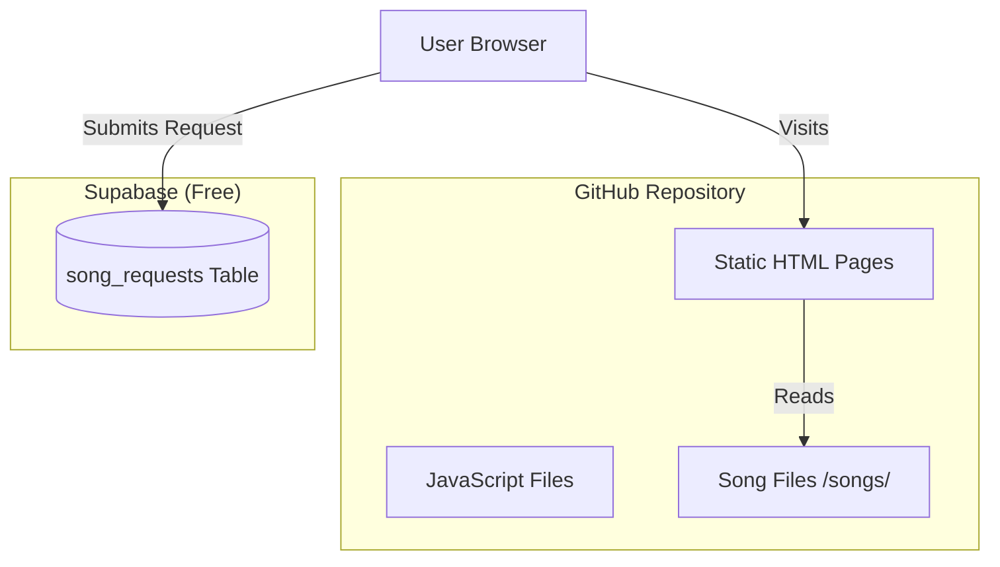

# Malayalam Christian Song Chords Website - Technical Plan (Updated)

## Project Overview
Convert existing static AdSense-approved website to a chords website with file-based song storage, user song requests, and UPI payment option.

**Current Site:** ecoliving-tips.github.io (GitHub Pages, AdSense approved)
**New Site Purpose:** Malayalam Christian Devotional Song Chords

---

## Architecture



---

## Key Changes Based on User Feedback

1. **Songs stored as files** - No database needed for songs
2. **Custom chord format** - Support for format like:
   ```
   Intro || C | C | Am | Am | B | B7 | Em | Em | Dm | Dm | A | A7 | Dm | G7 | C | C ||
   ```
3. **Browser searchable** - JavaScript-based search
4. **UPI Link + QR Code** - Both payment options

---

## Technology Stack

| Component | Technology | Reason |
|-----------|------------|--------|
| Frontend | Static HTML + Vanilla JS | Simple, no build step |
| Song Storage | Markdown/Text Files | Files in /songs/ folder |
| Requests | Supabase (Free) | Store user requests only |
| Hosting | GitHub Pages | Already deployed |
| Payment | UPI Link + QR Code | Popular in India |

---

## Song File Structure

Each song will be a simple text/markdown file in `/songs/` folder:

**Example: `/songs/anna-pesaha.md`**
```markdown
---
title: Anna Pesaha Thirunalil
artist: Traditional
youtube: https://youtube.com/watch?v=xxx
---

# Anna Pesaha Thirunalil

## Intro
|| C | C | Am | Am | B | B7 | Em | Em | Dm | Dm | A | A7 | Dm | G7 | C | C ||

## Verse 1
| C | G | Am | Em |
| F | G | C | G |

## Chorus
| C | F | G | C |
| Am | G | C | C |
```

---

## Page Structure

### 1. Home Page (index.html)
- Search bar for songs
- Recent/Featured songs
- Request a song button
- UPI Donate button + QR code
- AdSense preserved

### 2. Songs Page (songs.html)
- All songs list with search
- Filter by title
- Click to view chords

### 3. Song Detail (song.html?file=xxx)
- Displays chord notation nicely formatted
- YouTube embed
- Back to songs link

### 4. Request Page (request.html)
- Simple form: Name, Song Title, Message
- Saves to Supabase

---

## Features

### For Users
- ✅ Browse all songs
- ✅ Search songs instantly in browser
- ✅ View formatted chords
- ✅ Watch YouTube tutorials
- ✅ Request new songs
- ✅ Pay via UPI (link + QR code)

### For Admin (You)
- ✅ Add songs as simple text files
- ✅ No database needed for songs
- ✅ View requests in Supabase
- ✅ Just add file to /songs/ folder

---

## Implementation Steps

### Step 1: Prepare Song Files
- Create `/songs/` directory
- Add song files in your format
- Create index.json for song listing

### Step 2: Update HTML Pages
- Modify index.html
- Create songs.html
- Create song.html
- Create request.html

### Step 3: Add JavaScript
- Read song files
- Search functionality
- Format chords display

### Step 4: Add Supabase (for requests only)
- Create song_requests table
- Connect request form

### Step 5: Add UPI Payment
- Get your UPI ID
- Generate QR code
- Add link + image

### Step 6: Preserve AdSense
- Keep all AdSense tags

---

## Files Structure

```
ecoliving-tips.github.io/
├── index.html          # Homepage
├── songs.html          # All songs list
├── song.html           # Individual song view
├── request.html        # Song request form
├── css/
│   └── styles.css      # Updated styles
├── js/
│   ├── main.js         # Existing JS
│   └── songs.js        # Song loading/search
├── songs/
│   ├── index.json      # Song list
│   ├── song-1.md       # Chord file
│   ├── song-2.md       # Chord file
│   └── ...
├── assets/
│   └── upi-qr.png      # QR code image
└── ...
```

---

## AdSense Preservation

All existing AdSense tags will be preserved:
```html
<script async src="https://pagead2.googlesyndication.com/pagead/js/adsbygoogle.js?client=ca-pub-7438590583270235"
    crossorigin="anonymous"></script>
<meta name="google-adsense-account" content="ca-pub-7438590583270235">
```

---

## Benefits

1. **Simple** - No complex database for songs
2. **Fast** - All songs load from static files
3. **Searchable** - Instant browser-based search
4. **Easy to add songs** - Just add a text file
5. **Free** - Supabase free tier for requests only
6. **Payment ready** - UPI link + QR code

---

## What You Need to Provide

1. Your UPI ID (for payment link)
2. QR code image (or I can help generate)
3. Song files in your chord format
4. Supabase account (I'll help set up)
