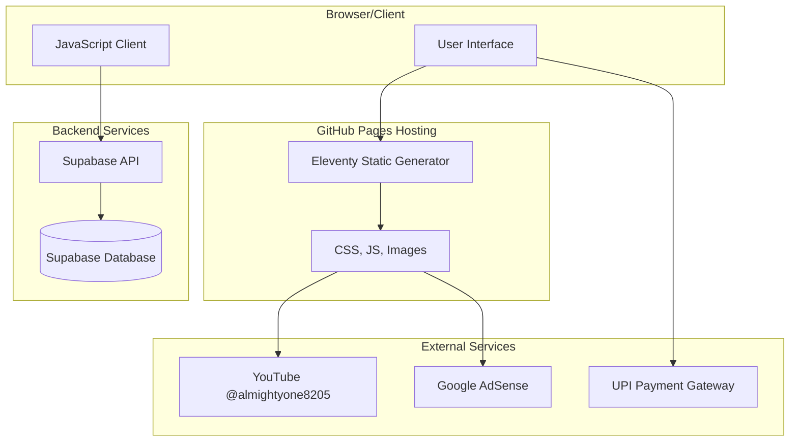
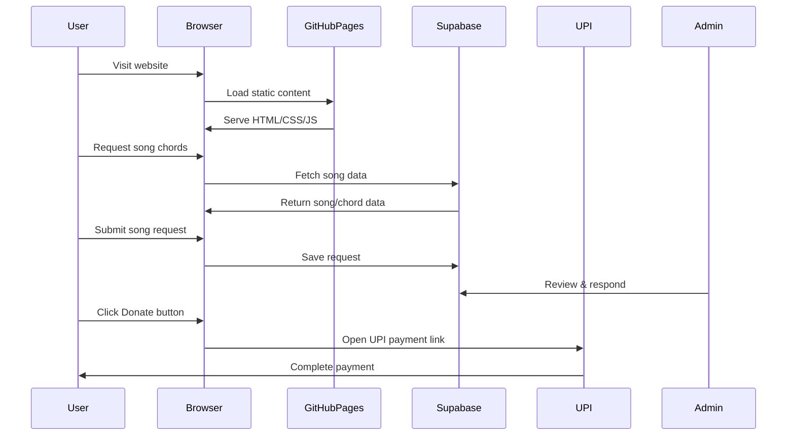

# Comprehensive Migration Plan: Static to Dynamic GitHub Pages Website

## Project Overview

**Project Name:** Malayalam Christian Devotional Songs Platform  
**Current Website:** https://ecoliving-tips.github.io  
**Primary Purpose:** Providing chords for Malayalam Christian Devotional Songs with user song request system and optional donations  
**Target Audience:** Malayalam Christian community, particularly Syro Malabar church musicians and worshippers in Kerala

---

## Executive Summary

This plan outlines the technical architecture and implementation strategy to convert the existing static HTML GitHub Pages website into a dynamic web platform while maintaining:
- GitHub Pages hosting
- All existing YouTube channel integration
- Google AdSense configuration and approval
- Current domain and URL structure
- SEO rankings and structured data

### Recommended Technology Stack

| Component | Technology | Reason |
|-----------|------------|--------|
| Static Site Generator | **Eleventy (11ty)** | Native GitHub Pages support, fast, flexible |
| Database | **Supabase** | Generous free tier, works with static sites, row-level security |
| Comments/Requests | **Supabase Database + Client** | No authentication required per user preference |
| Payments | **UPI Payment Links** | Zero fees, popular in Kerala, instant transfers |
| Deployment | **GitHub Pages** | Current hosting, no changes needed |

---

## Current Website Analysis

### Existing Assets to Preserve

| Asset | Current Implementation | Action |
|-------|----------------------|--------|
| Google AdSense | ca-pub-7438590583270235 | Preserve exactly as-is |
| YouTube Channel | @almightyone8205 | Maintain all embeds and links |
| SEO Structure | Structured data, meta tags | Enhance, not replace |
| RSS Feed | feed.xml | Continue maintaining |
| Sitemap | sitemap.xml | Auto-generate with new content |
| Favicon | assets/favicon.* | Preserve |

### Current Content Sections

1. **Hero Section** - Syro Malabar Holy Mass Tutorials
2. **Tutorial Categories** - 6 categories (Essential Songs, Chord Progressions, Background Music, Liturgical Practice, Traditional Ernakulam Tune, Notes & Chord Charts)
3. **Featured Video** - Anna Pesaha Thirunalil embed
4. **Popular Songs Grid** - Song cards with YouTube links
5. **Mindful Living Section**
6. **About Section**
7. **FAQ Section**
8. **Contact Form** - Currently emails to almighty33one@gmail.com

---

## Architecture Design

### System Architecture Diagram



### Data Flow



---

## Database Schema Design

### Supabase Tables

#### 1. songs table

```sql
-- Songs table storing chord information
CREATE TABLE songs (
  id UUID PRIMARY KEY DEFAULT gen_random_uuid(),
  title Malayalam VARCHAR(255) NOT NULL,
  title_english VARCHAR(255),
  category VARCHAR(100),
  youtube_video_id VARCHAR(50),
  youtube_playlist_id VARCHAR(100),
  chord_progression TEXT,
  notes TEXT,
  difficulty VARCHAR(50),
  views INTEGER DEFAULT 0,
  is_published BOOLEAN DEFAULT false,
  created_at TIMESTAMP WITH TIME ZONE DEFAULT NOW(),
  updated_at TIMESTAMP WITH TIME ZONE DEFAULT NOW()
);
```

#### 2. song_requests table

```sql
-- User song request system (no auth required)
CREATE TABLE song_requests (
  id UUID PRIMARY KEY DEFAULT gen_random_uuid(),
  song_title VARCHAR(255),
  requester_name VARCHAR(100),
  requester_email VARCHAR(255),
  message TEXT,
  status VARCHAR(20) DEFAULT 'pending', -- pending, in_progress, completed, rejected
  admin_notes TEXT,
  created_at TIMESTAMP WITH TIME ZONE DEFAULT NOW(),
  updated_at TIMESTAMP WITH TIME ZONE DEFAULT NOW()
);
```

#### 3. comments table

```sql
-- Comments on songs (no auth required)
CREATE TABLE comments (
  id UUID PRIMARY KEY DEFAULT gen_random_uuid(),
  song_id UUID REFERENCES songs(id),
  visitor_name VARCHAR(100),
  comment TEXT,
  is_approved BOOLEAN DEFAULT false, -- Manual moderation
  created_at TIMESTAMP WITH TIME ZONE DEFAULT NOW()
);
```

#### 4. settings table

```sql
-- Website settings
CREATE TABLE settings (
  key VARCHAR(100) PRIMARY KEY,
  value TEXT,
  updated_at TIMESTAMP WITH TIME ZONE DEFAULT NOW()
);
```

---

## Feature Implementation Plan

### Phase 1: Foundation (Week 1-2)

| Task | Description | Effort |
|------|-------------|--------|
| Set up Eleventy | Initialize 11ty project with current structure | Medium |
| Configure Supabase | Create project, database tables, get API keys | Medium |
| Update gitignore | Add Supabase config to ignore | Low |
| Create base layouts | Convert HTML to 11ty templates | Medium |
| Migrate CSS/JS | Move assets to new structure | Low |

### Phase 2: Core Features (Week 3-4)

| Task | Description | Effort |
|------|-------------|--------|
| Song Database Integration | Connect 11ty to Supabase for song data | Medium |
| Song Listing Page | Dynamic song grid with filtering | Medium |
| Individual Song Pages | Dedicated pages with chord displays | Medium |
| YouTube Embed Integration | Preserve video embeds | Low |

### Phase 3: User Interaction (Week 5-6)

| Task | Description | Effort |
|------|-------------|--------|
| Song Request Form | Form to request new songs | Medium |
| Comment System | Visitor comments on songs | Medium |
| Admin Dashboard | Simple admin for moderation | Medium |
| Email Notifications | Admin alerts for new requests | Low |

### Phase 4: Monetization (Week 7)

| Task | Description | Effort |
|------|-------------|--------|
| UPI Donation Integration | Add donation button with UPI link | Low |
| Donation Page | Styled donation/support page | Low |
| Update Privacy Policy | Include donation terms | Medium |

### Phase 5: Polish & Launch (Week 8)

| Task | Description | Effort |
|------|-------------|--------|
| SEO Enhancement | Add dynamic meta tags, structured data | Medium |
| Mobile Responsiveness | Test and fix issues | Medium |
| Performance Optimization | Lighthouse optimization | Medium |
| AdSense Verification | Ensure ads still work | Low |
| Final URL Testing | Verify all redirects work | Medium |

---

## UI/UX Design for Malayalam Christian Audience

### Design Principles

1. **Cultural Relevance**: Incorporate elements that resonate with Kerala Christian heritage
2. **Simplicity**: Clean, uncluttered interface suitable for all age groups
3. **Accessibility**: High contrast, readable fonts for elderly users
4. **Mobile-First**: Primary audience accesses via mobile devices

### Color Scheme Enhancement

| Element | Current | Recommended Addition |
|---------|---------|---------------------|
| Primary | #4CAF50 (Green) | Keep for eco/environment aspects |
| Secondary | #388E3C | Maintain |
| Accent | #8BC34A | Add cross/candle motif |
| Festive | - | #C62828 (Syro Malabar liturgical red) |
| Gold | - | #FFD700 (For feast days, special occasions) |

### Typography

- **English**: Poppins (current) - Keep
- **Malayalam**: Manjari or Rachana (free Malayalam fonts from Google Fonts)
- **Heading Hierarchy**: Clear Malayalam + English bilingual support

### Layout Components

1. **Header**: Bilingual logo, navigation, donation button
2. **Hero**: Featured song with YouTube embed
3. **Song Categories**: Icon-based grid
4. **Search**: Prominent search for song titles (English + Malayalam)
5. **Request Button**: Fixed CTA for song requests
6. **Footer**: Quick links, social, donation, legal

---

## SEO Optimization Strategy

### Preserve Current SEO

All existing structured data, meta tags, and sitemap configurations will be enhanced:

| Element | Current Status | Action |
|---------|----------------|--------|
| Meta Description | ✅ Present | Enhance with dynamic content |
| Open Graph | ✅ Present | Make dynamic |
| Schema.org | ✅ EducationalOrg, VideoObject | Add BreadcrumbList, FAQPage |
| Sitemap | ✅ Present | Auto-generate with new content |
| robots.txt | ✅ Present | Update for dynamic routes |
| RSS Feed | ✅ Present | Continue |

### New SEO Opportunities

1. **Song-Specific Pages**: Each song gets dedicated URL (e.g., `/songs/anna-pesaha-thirunalil/`)
2. **Structured Data**: Add Song/Track schema for each chord page
3. **Bilingual SEO**: Malayalam and English keywords
4. **FAQ Schema**: For common chord questions
5. **Breadcrumb Navigation**: For song categories

### URL Structure Preservation

| Old URL | New URL | Notes |
|---------|---------|-------|
| `/` | `/` | Home (dynamic) |
| `/index.html` | Redirect to `/` | 301 redirect |
| `/privacy-policy.html` | `/privacy/` | Cleaner URL |

---

## AdSense Preservation Strategy

### Current Configuration

- **Publisher ID**: ca-pub-7438590583270235
- **Verification Meta**: Multiple verification tags present
- **Ad Units**: Need to identify existing placements

### Action Plan

1. **Do Not Modify**: Keep AdSense script tags exactly as-is
2. **Test Before/After**: Verify ad display after migration
3. **Responsive Units**: Add responsive ad units in new templates
4. **Policy Compliance**: Ensure comment system doesn't violate policies

### Ad Placement Recommendations

| Position | Ad Type | Implementation |
|----------|---------|----------------|
| Header | Responsive | Below navigation |
| Between Songs | Horizontal | Song grid breaks |
| Song Page | In-article | After chord display |
| Footer | Display | Above footer |

---

## YouTube Integration

### Current YouTube Assets

| Channel | URL |
|---------|-----|
| Main Channel | https://www.youtube.com/@almightyone8205 |
| Featured Video | Anna Pesaha Thirunalil (CGfSjeFkL-0) |

### Integration Methods

1. **Channel Subscribe Button**: Prominent in hero section
2. **Video Embeds**: Lazy-loaded YouTube embeds
3. **Playlist Links**: Category-specific playlists
4. **Video Cards**: Display video thumbnails with titles

---

## Payment Integration (UPI)

### Implementation

```javascript
// UPI Payment Link Configuration
const upiConfig = {
  // Replace with your actual UPI ID
  upiId: 'yourname@bankname', 
  // Pre-fill amount (optional)
  amount: '',
  // Transaction note
  note: 'Support for Malayalam Christian Music Tutorials',
  // Merchant name
  mn: 'Mindful Living & Devotional Music'
};

// Generate UPI payment URL
const upiPaymentUrl = `upi://pay?pa=${upiConfig.upiId}&pn=${encodeURIComponent(upiConfig.mn)}&tn=${encodeURIComponent(upiConfig.note)}`;
```

### Donation Page Features

1. **UPI QR Code**: Generate QR code for easy scanning
2. **Payment Link**: Direct UPI deep link
3. **Bank Transfer Details**: As backup option
4. **Support Message**: Explain how donations help

---

## Risk Assessment & Mitigation

| Risk | Impact | Mitigation |
|------|--------|------------|
| AdSense Disapproval | High | Keep exact same AdSense config, test thoroughly |
| SEO Ranking Drop | High | Implement 301 redirects, maintain content quality |
| Database Costs | Medium | Use Supabase free tier, monitor usage |
| Performance Issues | Medium | Static generation, lazy loading, caching |
| User Spam | Low | Manual moderation queue |

---

## Implementation Checklist

### Pre-Migration
- [ ] Backup current website files
- [ ] Document all current URLs
- [ ] Set up Supabase project
- [ ] Create staging environment

### Migration Steps
- [ ] Initialize Eleventy project
- [ ] Create Supabase database tables
- [ ] Build base templates
- [ ] Migrate existing content
- [ ] Implement song request system
- [ ] Implement comment system
- [ ] Add UPI donation
- [ ] Verify AdSense integration
- [ ] Test all functionality
- [ ] Deploy to GitHub Pages

### Post-Migration
- [ ] Verify all URLs work
- [ ] Check AdSense ads display
- [ ] Test mobile responsiveness
- [ ] Verify SEO tools
- [ ] Monitor for errors

---

## Success Metrics

| Metric | Target | Measurement |
|--------|--------|--------------|
| Page Load Time | < 3 seconds | Lighthouse |
| Mobile Score | > 90 | Google PageSpeed |
| AdSense Revenue | Maintain | AdSense dashboard |
| Song Requests | 10+/month | Database |
| Comments | 20+/month | Database |

---

## Next Steps

1. **Approval**: Review and approve this plan
2. **Setup**: Initialize Eleventy + Supabase projects
3. **Development**: Begin Phase 1 implementation
4. **Testing**: Staging environment validation
5. **Launch**: Deploy to production GitHub Pages

---

*Plan Version: 1.0*  
*Created: March 2026*  
*For: Malayalam Christian Keyboard Tutorials Platform*
